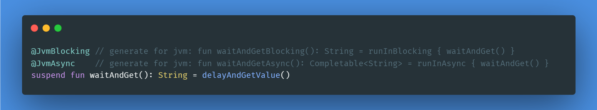

# Kotlin suspend transform compiler plugin
[](https://repo1.maven.org/maven2/love/forte/plugin/suspend-transform/suspend-transform-plugin/) 
[](https://plugins.gradle.org/plugin/love.forte.plugin.suspend-transform)



[GitHub](https://github.com/ForteScarlet/kotlin-suspend-transform-compiler-plugin) | [Gitee](https://gitee.com/ForteScarlet/kotlin-suspend-transform-compiler-plugin)

**English** | [简体中文](README_CN.md)

## Summary

Kotlin compiler plugin for generating platform-compatible functions for suspend functions.

### JVM

```kotlin
class Foo {
    @JvmBlocking
    @JvmAsync
    suspend fun waitAndGet(): String {
        delay(5)
        return "Hello"
    } 
}
```

compiled 👇

```kotlin
class Foo {
    // Hide from Java
    @JvmSynthetic
    suspend fun waitAndGet(): String {
        delay(5)
        return "Hello"
    }
    @Api4J // RequiresOptIn annotation, provide warnings to Kotlin
    fun waitAndGetBlocking(): String = runInBlocking { waitAndGet() } // 'runInBlocking' from the runtime provided by the plugin

    @Api4J // RequiresOptIn annotation, provide warnings to Kotlin
    fun waitAndGetAsync(): CompletableFuture<out String> = runInAsync { waitAndGet() } // 'runInAsync' from the runtime provided by the plugin
}
```

### JS

```kotlin
class Foo {
    @JsPromise
    suspend fun waitAndGet(): String {
        delay(5)
        return "Hello"
    } 
}
```

compiled 👇

```kotlin
class Foo {
    suspend fun waitAndGet(): String {
        delay(5)
        return "Hello"
    }
    @Api4Js // RequiresOptIn annotation, provide warnings to Kotlin
    fun waitAndGetAsync(): Promise<String> = runInAsync { waitAndGet() } // 'runInAsync' from the runtime provided by the plugin
}
```

> ~~JS platform target not supported yet. see: [KT-53993](https://youtrack.jetbrains.com/issue/KT-53993)~~
>
> JS has been supported since 0.6.0! See the process at [KT-53993](https://youtrack.jetbrains.com/issue/KT-53993), and the final winning shot at [#39](https://github.com/ForteScarlet/kotlin-suspend-transform-compiler-plugin/pull/39)!

### WasmJS

> [!warning]
> Since `v0.6.0`, In experiments, immature and unstable

```kotlin
class Foo {
    @JsPromise
    suspend fun waitAndGet(): String {
        delay(5)
        return "Hello"
    } 
}

// Some functions or types customised by **you**...
// They are not included in the runtime. 
// Since there are a lot of restrictions on the use of various types in WasmJS...
// so I'm not sure how to handle them perfectly yet.
// Until then, you can customise functions and types to control the behaviour of the compiler plugin yourself.
// just like you can customise other platforms.

fun <T> runInAsync(block: suspend () -> T): AsyncResult<T> = AsyncResult(block)

class AsyncResult<T>(val block: suspend () -> T) {
    @OptIn(DelicateCoroutinesApi::class)
    fun toPromise(): Promise<JsAny?> {
        return GlobalScope.promise { block() }
    }
}
```

compiled 👇

```kotlin
class Foo {
    suspend fun waitAndGet(): String {
        delay(5)
        return "Hello"
    }
    @Api4Js // RequiresOptIn annotation, provide warnings to Kotlin
    fun waitAndGetAsync(): AsyncResult<String> = runInAsync { waitAndGet() } // 'runInAsync' from the runtime provided by the plugin
    // AsyncResult is a custom type by **you**
}
```

## Usage

### The version

Prior to 0.9.0 (included), the naming convention for versions was `x.y.z`. 
But it seems that the contents of the Kotlin compiler may find changes with each version, 
and such version numbers do not reflect the corresponding Kotlin version, 
and may lead to some confusion as a result.

Therefore, starting after `0.9.0`, versions will be named in the form `$Kotlin-$plugin`, 
e.g. `2.0.20-0.9.1`. 
The first half is the version of Kotlin used for the build, while the second half is the version of this plugin.

If the version is less than or equal to `0.9.0`, you can refer to this comparison table:

| Kotlin version | plugin version          |
|----------------|-------------------------|
| `2.0.0`        | `0.8.0-beta1` ~ `0.9.0` |
| `1.9.22`       | `0.7.0-beta1`           |
| `1.9.21`       | `0.6.0`                 |
| `1.9.10`       | `0.5.1`                 |
| `1.9.0`        | `0.5.0`                 |
| `1.8.21`       | `0.3.1` ~ `0.4.0`       |

> [!note]
> I haven't documented in detail the compiler plugin compatibility between each Kotlin version.
> From my memory and guess, Kotlin versions have a higher probability of incompatibility when minor is added (e.g. `1.8.0` -> `1.9.0`), 
> and a smaller probability of incompatibility when patch is added (e.g. `1.9.21` -> `1.9.22`).

### Gradle

**Using the [plugins DSL](https://docs.gradle.org/current/userguide/plugins.html#sec:plugins_block):**

_build.gradle.kts_

```kotlin
plugins {
    id("org.jetbrains.kotlin.jvm") version "$KOTLIN_VERSION" // or js? or multiplatform?
    id("love.forte.plugin.suspend-transform") version "$PLUGIN_VERSION" 
    // other...
}

// other...

// config it.
suspendTransform {
    enabled = true // default: true
    includeRuntime = true // default: true
    includeAnnotation = true // default: true

    /*
     * Use both `useJvmDefault` and `useJsDefault`.
     * Need to include the runtime and annotation.
     */
    // useDefault()
    
    /*
     * Use the default configuration for JVM platform,
     * Equivalent:
     * addJvmTransformers(
     *     SuspendTransformConfiguration.jvmBlockingTransformer,
     *     SuspendTransformConfiguration.jvmAsyncTransformer,
     * )
     *
     * Need to include the runtime and annotation.
     */
    useJvmDefault()
    
    // or custom by yourself 
    jvm {
        // ...
    }
    // or 
    addJvmTransformers(...)

    /*
     * Use the default configuration for JS platform,
     * Equivalent:
     * addJvmTransformers(
     *     SuspendTransformConfiguration.jsPromiseTransformer,
     * )
     *
     * Need to include the runtime and annotation.
     */
    useJsDefault()

    // or custom by yourself 
    js {
        // ...
    }
    // or 
    addJsTransformers(...)
}
```

**Using [legacy plugin application](https://docs.gradle.org/current/userguide/plugins.html#sec:old_plugin_application):**

_build.gradle.kts_

```kotlin
buildscript {
    repositories {
        mavenCentral()
        gradlePluginPortal()
    }
    dependencies {
        classpath("love.forte.plugin.suspend-transform:suspend-transform-plugin-gradle:$GRADLE_PLUGIN_VERSION")
    }
}

plugins {
    id("org.jetbrains.kotlin.jvm") // or js? or multiplatform?
    id("love.forte.plugin.suspend-transform") 
    // other...
}

// other...

// config it.
suspendTransform {
    enabled = true // default: true
    includeRuntime = true // default: true
    includeAnnotation = true // default: true

    /*
     * Use both `useJvmDefault` and `useJsDefault`.
     * Need to include the runtime and annotation.
     */
    // useDefault()

    /*
     * Use the default configuration for JVM platform,
     * Equivalent:
     * addJvmTransformers(
     *     SuspendTransformConfiguration.jvmBlockingTransformer,
     *     SuspendTransformConfiguration.jvmAsyncTransformer,
     * )
     *
     * Need to include the runtime and annotation.
     */
    useJvmDefault()

    // or custom by yourself 
    jvm {
        // ...
    }
    // or 
    addJvmTransformers(...)

    /*
     * Use the default configuration for JS platform,
     * Equivalent:
     * addJvmTransformers(
     *     SuspendTransformConfiguration.jsPromiseTransformer,
     * )
     *
     * Need to include the runtime and annotation.
     */
    useJsDefault()

    // or custom by yourself 
    js {
        // ...
    }
    // or 
    addJsTransformers(...)
}
```

## Cautions

### Gradle JVM

**Gradle JVM** must be JDK11+

### K2

K2 is supported since `v0.7.0`.

> [!warning]
> In experiments.

### JsExport

If you want to use `@JsExport` with default configuration in JS,
try this:

_build.gradle.kts_

```kotlin
plugins {
    ...
}

suspendTransform {
    addJsTransformers(
        SuspendTransformConfiguration.jsPromiseTransformer.copy(
            copyAnnotationExcludes = listOf(
                // The generated function does not include `@JsExport.Ignore`.
                ClassInfo("kotlin.js", "JsExport.Ignore")
            )
        )
    )
}
```

```Kotlin
@file:OptIn(ExperimentalJsExport::class)

@JsExport
class Foo {
    @JsPromise
    @JsExport.Ignore
    suspend fun run(): Int = ...
}
```

## Effect

**source:**

```kotlin
import love.forte.plugin.suspendtrans.annotation.JvmAsync
import love.forte.plugin.suspendtrans.annotation.JvmBlocking

@JvmBlocking
@JvmAsync
interface Foo {

    suspend fun name(): String

    suspend fun age(def: Int = 5): Int

    @JvmBlocking(asProperty = true)
    suspend fun self(): Foo
}

@JvmBlocking
@JvmAsync
class FooImpl : Foo {
    suspend fun size(): Long = 666
    override suspend fun name(): String = "forte"
    override suspend fun age(def: Int): Int = def
    @JvmBlocking(asProperty = true) // must be 'asProperty=true'
    override suspend fun self(): FooImpl = this
}

class Bar {
    @JvmBlocking
    @JvmAsync
    suspend fun bar(): String = ""

    suspend fun noTrans(): Int = 1
}
```

**compiled:**

> _Simplified from decompiled results._

```kotlin
import love.forte.plugin.suspendtrans.annotation.JvmAsync
import love.forte.plugin.suspendtrans.annotation.JvmBlocking
import love.forte.plugin.suspendtrans.annotation.Generated
import love.forte.plugin.suspendtrans.annotation.Api4J
import kotlin.jvm.JvmSynthetic

@JvmBlocking 
@JvmAsync
interface Foo {
    @Generated 
    @Api4J 
    val selfBlocking: Foo /* compiled code */

    suspend fun age(def: Int /* = compiled code */): Int

    @Generated 
    @Api4J 
    fun ageAsync(def: Int /* = compiled code */): java.util.concurrent.CompletableFuture<Int> { /* compiled code */ }

    @Generated 
    @Api4J 
    fun ageBlocking(def: Int /* = compiled code */): Int { /* compiled code */ }

    suspend fun name(): String

    @Generated 
    @Api4J 
    fun nameAsync(): java.util.concurrent.CompletableFuture<out String> { /* compiled code */ }

    @Generated 
    @Api4J 
    fun nameBlocking(): String { /* compiled code */ }

    @JvmBlocking 
    suspend fun self(): Foo

    @Generated 
    @Api4J 
    fun selfAsync(): java.util.concurrent.CompletableFuture<out Foo> { /* compiled code */ }
}

@JvmBlocking 
@JvmAsync 
class FooImpl : Foo {
    @Generated 
    @Api4J 
    open val selfBlocking: FooImpl /* compiled code */

    @JvmSynthetic
    open suspend fun age(def: Int): Int { /* compiled code */ }

    @Generated 
    @Api4J 
    open fun ageAsync(def: Int): java.util.concurrent.CompletableFuture<Int> { /* compiled code */ }

    @Generated 
    @Api4J 
    open fun ageBlocking(def: Int): Int { /* compiled code */ }

    @JvmSynthetic
    open suspend fun name(): String { /* compiled code */ }

    @Generated 
    @Api4J 
    open fun nameAsync(): java.util.concurrent.CompletableFuture<out String> { /* compiled code */ }

    @Generated 
    @Api4J 
    open fun nameBlocking(): String { /* compiled code */ }

    @JvmSynthetic
    @JvmBlocking 
    suspend fun self(): FooImpl { /* compiled code */ }

    @Generated 
    @Api4J
    fun selfAsync(): java.util.concurrent.CompletableFuture<out FooImpl> { /* compiled code */ }

    @JvmSynthetic
    suspend fun size(): Long { /* compiled code */ }

    @Generated 
    @Api4J
    fun sizeAsync(): java.util.concurrent.CompletableFuture<Long> { /* compiled code */ }

    @Generated 
    @Api4J
    fun sizeBlocking(): Long { /* compiled code */ }
}


class Bar {
    @JvmSynthetic
    @JvmBlocking 
    @JvmAsync
    suspend fun bar(): String { /* compiled code */ }

    @Generated 
    @Api4J 
    fun barAsync(): java.util.concurrent.CompletableFuture<out String> { /* compiled code */ }

    @Generated 
    @Api4J 
    fun barBlocking(): String { /* compiled code */ }

    fun noTrans(): Int { /* compiled code */ }
}
```

## Custom config

```kotlin
plugin {
    id("love.forte.plugin.suspend-transform") version "$VERSION"
}


suspendTransform {
    // enabled suspend transform plugin
    enabled = true
    // include 'love.forte.plugin.suspend-transform:suspend-transform-runtime' to the runtime environment
    includeRuntime = true
    // the configuration name for including 'love.forte.plugin.suspend-transform:suspend-transform-runtime'
    runtimeConfigurationName = "implementation"

    val customJvmTransformer = Transformer(
        // mark annotation info, e.g. `@JvmBlocking`
        markAnnotation = MarkAnnotation(
            classInfo = ClassInfo("love.forte.plugin.suspendtrans.annotation", "JvmBlocking"), // class info for this annotation
            baseNameProperty = "baseName",      // The property used to represent the 'base name' in the annotation, e.g. `@JvmBlocking(baseName = ...)`
            suffixProperty = "suffix",          // The property used to represent the 'suffix' in the annotation, e.g. `@JvmBlocking(suffix = ...)`
            asPropertyProperty = "asProperty",  // The property used to represent the 'asProperty' in the annotation, e.g. `@JvmBlocking(asProperty = true|false)`
            defaultSuffix = "Blocking",         // Default value used when property 'suffix' (the value of suffixProperty) does not exist (when not specified by the user) (the compiler plugin cannot detect property defaults directly, so the default value must be specified from here)
            // e.g. @JvmBlocking(suffix = "Abc"), the suffix is 'Abc', but `@JvmBlocking()`, the suffix is null in compiler plugin, so use the default suffix value.
            defaultAsProperty = false,          // Default value used when property 'suffix' (the value of suffixProperty) does not exist (Similar to defaultSuffix)
        ),
        // the transform function, e.g. 
        // 👇 `love.forte.plugin.suspendtrans.runtime.$runInBlocking$`
        // it will be like 
        // ```
        // @JvmBlocking suspend fun runXxx() { ... }
        // fun runXxxBlocking() = `$runInBlocking$` { runXxx() /* suspend  */ } // generated function
        // ```
        transformFunctionInfo = FunctionInfo(
            packageName = "love.forte.plugin.suspendtrans.runtime", 
            className = null, // null if top-level function
            functionName = "\$runInBlocking\$"
        ),
        transformReturnType = null, // return type, or null if return the return type of origin function, e.g. `ClassInfo("java.util.concurrent", "CompletableFuture")`
        transformReturnTypeGeneric = false, // if you return like `CompletableFuture<T>`, make it `true`
        originFunctionIncludeAnnotations = listOf(IncludeAnnotation(ClassInfo("kotlin.jvm", "JvmSynthetic"))), // include into origin function
        copyAnnotationsToSyntheticFunction = true,
        copyAnnotationExcludes = listOf(ClassInfo("kotlin.jvm", "JvmSynthetic")), // do not copy from origin function
        syntheticFunctionIncludeAnnotations = listOf(IncludeAnnotation(jvmApi4JAnnotationClassInfo)) // include into synthetic function
    )
    
    addJvmTransformers(
        customJvmTransformer, ...
    )
    
    // or addJsTransformers(...)
    
}
```


## License

see [LICENSE](LICENSE) .

```text
Copyright (c) 2022 ForteScarlet

Permission is hereby granted, free of charge, to any person obtaining a copy
of this software and associated documentation files (the "Software"), to deal
in the Software without restriction, including without limitation the rights
to use, copy, modify, merge, publish, distribute, sublicense, and/or sell
copies of the Software, and to permit persons to whom the Software is
furnished to do so, subject to the following conditions:

The above copyright notice and this permission notice shall be included in all
copies or substantial portions of the Software.

THE SOFTWARE IS PROVIDED "AS IS", WITHOUT WARRANTY OF ANY KIND, EXPRESS OR
IMPLIED, INCLUDING BUT NOT LIMITED TO THE WARRANTIES OF MERCHANTABILITY,
FITNESS FOR A PARTICULAR PURPOSE AND NONINFRINGEMENT. IN NO EVENT SHALL THE
AUTHORS OR COPYRIGHT HOLDERS BE LIABLE FOR ANY CLAIM, DAMAGES OR OTHER
LIABILITY, WHETHER IN AN ACTION OF CONTRACT, TORT OR OTHERWISE, ARISING FROM,
OUT OF OR IN CONNECTION WITH THE SOFTWARE OR THE USE OR OTHER DEALINGS IN THE
SOFTWARE.
```
