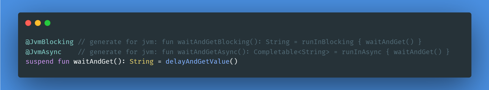

# Kotlin suspend transform 编译器插件
[](https://repo1.maven.org/maven2/love/forte/plugin/suspend-transform/suspend-transform-plugin/)
[](https://plugins.gradle.org/plugin/love.forte.plugin.suspend-transform)



[GitHub](https://github.com/ForteScarlet/kotlin-suspend-transform-compiler-plugin) | [Gitee](https://gitee.com/ForteScarlet/kotlin-suspend-transform-compiler-plugin)

**English** | [简体中文](README_CN.md)

## 文档

请参见 [文档](https://kstcp.forte.love/)。

> [!note]
> 如果文档有任何问题或遗漏，欢迎随时[反馈](https://github.com/ForteScarlet/kotlin-suspend-transform-compiler-plugin/issues)！

## 这是什么？

这是一个用于为挂起函数生成平台兼容函数的 Kotlin 编译器插件。

### JVM

```kotlin
class Foo {
    @JvmBlocking
    @JvmAsync
    suspend fun waitAndGet(): String {
        delay(5)
        return "Hello"
    } 
}
```

编译后 👇

```kotlin
class Foo {
    // 对 Java 隐藏
    @JvmSynthetic
    suspend fun waitAndGet(): String {
        delay(5)
        return "Hello"
    }
    @Api4J // 需要显式启用的注解，向 Kotlin 提供警告
    fun waitAndGetBlocking(): String = runInBlocking { waitAndGet() } // 'runInBlocking' 来自插件提供的运行时

    @Api4J // 需要显式启用的注解，向 Kotlin 提供警告
    fun waitAndGetAsync(): CompletableFuture<out String> = runInAsync { waitAndGet() } // 'runInAsync' 来自插件提供的运行时
}
```

### JS

```kotlin
class Foo {
    @JsPromise
    suspend fun waitAndGet(): String {
        delay(5)
        return "Hello"
    } 
}
```

编译后 👇

```kotlin
class Foo {
    suspend fun waitAndGet(): String {
        delay(5)
        return "Hello"
    }
    @Api4Js // 需要显式启用的注解，向 Kotlin 提供警告
    fun waitAndGetAsync(): Promise<String> = runInAsync { waitAndGet() } // 'runInAsync' 来自插件提供的运行时
}
```

> ~~JS 平台目标暂未支持。参见：[KT-53993](https://youtrack.jetbrains.com/issue/KT-53993)~~
>
> 自 0.6.0 版本起已支持 JS！进展见 [KT-53993](https://youtrack.jetbrains.com/issue/KT-53993)，最终实现见 [#39](https://github.com/ForteScarlet/kotlin-suspend-transform-compiler-plugin/pull/39)！

### WasmJS

> [!warning]
> 自 `v0.6.0` 起处于实验阶段，不成熟且不稳定

```kotlin
class Foo {
    @JsPromise
    suspend fun waitAndGet(): String {
        delay(5)
        return "Hello"
    } 
}

// 由**你**自定义的部分函数或类型...
// 这些不包含在运行时中。
// 由于 WasmJS 对各类使用存在诸多限制...
// 目前尚未找到完美处理方式。
// 在此之前，你可以自定义函数和类型来控制编译器插件的行为，
// 就像对其他平台所做的那样。

fun <T> runInAsync(block: suspend () -> T): AsyncResult<T> = AsyncResult(block)

class AsyncResult<T>(val block: suspend () -> T) {
    @OptIn(DelicateCoroutinesApi::class)
    fun toPromise(): Promise<JsAny?> {
        return GlobalScope.promise { block() }
    }
}
```

编译后 👇

```kotlin
class Foo {
    suspend fun waitAndGet(): String {
        delay(5)
        return "Hello"
    }
    @Api4Js // 需要显式启用的注解，向 Kotlin 提供警告
    fun waitAndGetAsync(): AsyncResult<String> = runInAsync { waitAndGet() } // 'runInAsync' 来自插件提供的运行时
    // AsyncResult 是**你**自定义的类型
}
```

### MarkName

> 自 v0.13.0 起, [#96](https://github.com/ForteScarlet/kotlin-suspend-transform-compiler-plugin/pull/96)

你可以使用 `markName` 为生成的合成函数添加名称标记注解（例如 `@JvmName`、`@JsName`）。

例如 JVM：

```kotlin
class Foo {
    @JvmBlocking(markName = "namedWaitAndGet")
    suspend fun waitAndGet(): String {
        delay(5)
        return "Hello"
    } 
}
```

编译后 👇

```kotlin
class Foo {
    // 对 Java 隐藏
    @JvmSynthetic
    suspend fun waitAndGet(): String {
        delay(5)
        return "Hello"
    }
    @Api4J // 需要显式启用的注解，向 Kotlin 提供警告
    @JvmName("namedWaitAndGet") // 来自 `markName` 的值
    fun waitAndGetBlocking(): String = runInBlocking { waitAndGet() } // 'runInBlocking' 来自插件提供的运行时
}
```

注意：`@JvmName` 在非 final 函数上有限制，甚至编译器可能会阻止编译。

例如 JS：

```kotlin
class Foo {
    @JsPromise(markName = "namedWaitAndGet")
    suspend fun waitAndGet(): String {
        delay(5)
        return "Hello"
    } 
}
```

编译后 👇

```kotlin
class Foo {
    suspend fun waitAndGet(): String {
        delay(5)
        return "Hello"
    }

    @Api4Js // 需要显式启用的注解，向 Kotlin 提供警告
    @JsName("namedWaitAndGet") // 来自 `markName` 的值
    fun waitAndGetAsync(): Promise<String> = runInAsync { waitAndGet() } // 'runInAsync' 来自插件提供的运行时
}
```

## 应用案例

- [Simple Robot Frameworks](https://github.com/simple-robot/simpler-robot) (完全自定义实现)

## 许可证

见 [LICENSE](LICENSE) 。

```text
Copyright (c) 2022 ForteScarlet

Permission is hereby granted, free of charge, to any person obtaining a copy
of this software and associated documentation files (the "Software"), to deal
in the Software without restriction, including without limitation the rights
to use, copy, modify, merge, publish, distribute, sublicense, and/or sell
copies of the Software, and to permit persons to whom the Software is
furnished to do so, subject to the following conditions:

The above copyright notice and this permission notice shall be included in all
copies or substantial portions of the Software.

THE SOFTWARE IS PROVIDED "AS IS", WITHOUT WARRANTY OF ANY KIND, EXPRESS OR
IMPLIED, INCLUDING BUT NOT LIMITED TO THE WARRANTIES OF MERCHANTABILITY,
FITNESS FOR A PARTICULAR PURPOSE AND NONINFRINGEMENT. IN NO EVENT SHALL THE
AUTHORS OR COPYRIGHT HOLDERS BE LIABLE FOR ANY CLAIM, DAMAGES OR OTHER
LIABILITY, WHETHER IN AN ACTION OF CONTRACT, TORT OR OTHERWISE, ARISING FROM,
OUT OF OR IN CONNECTION WITH THE SOFTWARE OR THE USE OR OTHER DEALINGS IN THE
SOFTWARE.
```
